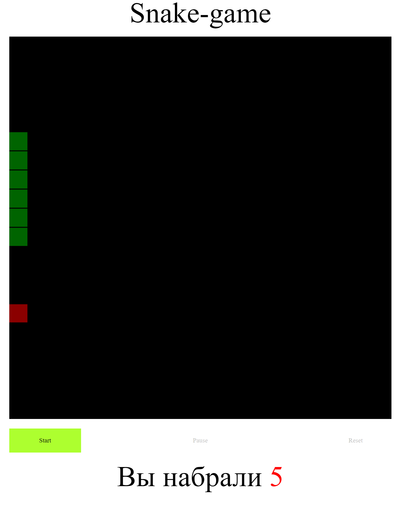

**Игра змейка**  

*Элементы управления:*  
- Start *запуск игры*  
- Pause *остановить/продолжить игру*  
- Reset *сбросить игру*  

*Управление змейкой с помошью кнопок* **Left, Up, Right, Down.**

Для реализации использовал js, canvas.  
 

* [Работа на GitHub Pages](https://apostaldante.github.io/snake/)  

  

**Desktop**
  

